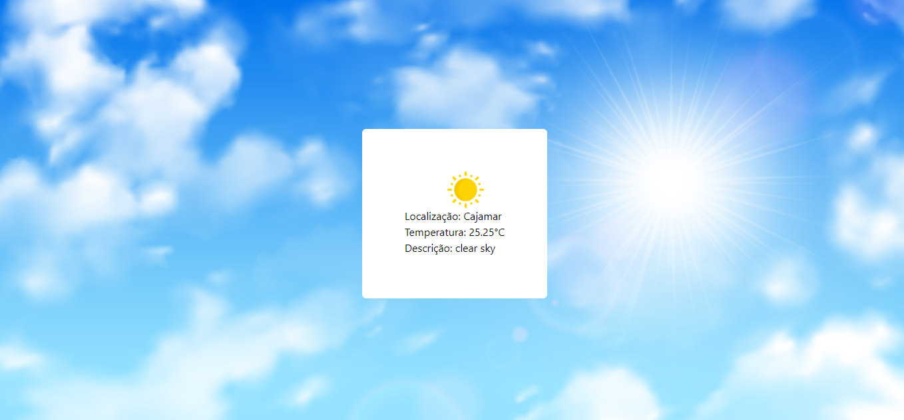
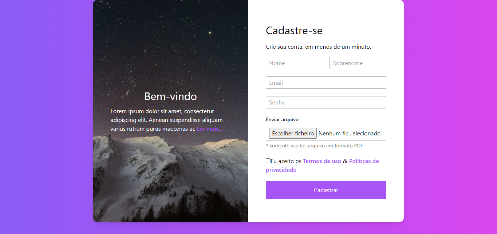

This is a [Next.js](https://nextjs.org/) project bootstrapped with [`create-next-app`](https://github.com/vercel/next.js/tree/canary/packages/create-next-app).

## Para inicializar a aplicação 

First, run the development server:

```bash
npm run dev
# or
yarn dev
# or
pnpm dev
```

Abra [http://localhost:3000](http://localhost:3000) no seu navegador para ver o resultado.
Também Disponível na Vercel: ou "https://desafio-front-end-opal.vercel.app/"

```bash
Para abrir as respesctivas aplicações (Clima, Cep, Formulario), é necessário que
utilize um path para cada uma delas, sendo:

Acesso aplicação clima utilizar: "http://localhost:3000/clima" ou "https://desafio-front-end-opal.vercel.app/clima"
Acesso aplicação cep utilizar: "http://localhost:3000/cep" ou "https://desafio-front-end-opal.vercel.app/cep"
Acesso aplicação formulario utilizar: "http://localhost:3000/form" ou "https://desafio-front-end-opal.vercel.app/form"
```
## Layout aplicações: 

## Aplicação CLIMA:
<h1 align="center">
  
</h1>

## Aplicação CEP:
<h1 align="center">
  
</h1>

## Aplicação FORMULÁRIO:
<h1 align="center">
  
</h1>
